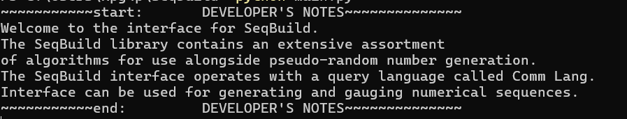

# About: seqbuild 

Sequentete...sequentete, my son. 

*Work-in-progress* 

Project is being developed in conjunction with 
that of dependency library, `morebs2`. Started out 
as a research project, and I am starting to wrap 
ends to it before the project branches off into 
development hell terrain. 

And here is this, because and for the 
kleptos, and because not specifying 
copyright encourages intellectual 
property theft (I may assume IP laws 
are still honored). Remember that all 
software is proprietary unless otherwise 
specified by a FOSS license. 

*Sorry that I had to put this poison pill provision into this project.*
*That said, the free market has never been that free with research and*
*emerging technologies.*

Copyright 2025 Richard Pham 

### Brief Description (Current State)  

Primary use is a research tool for pseudo-random number generators (PRNG).  
Comm Lang is the application programming interface that `seqbuild` uses,  
and users can express commands to gauge and generate numerical sequences  
in this language. When user runs `main.py` (the main program), they are 
accessing a semi-autonomous PRNG system for their personal use. They are  
responsible for: 
- initializing generators 
- gauging generators and numerical sequences
- tweaking generators and numerical sequences. 

Autonomous capabilities for `seqbuild` to perpetually output values classified 
as "random", according to certain metrics, have not been implemented. 

### Update: 8/22/25  

There are still unfinished features in this project. Development will no 
longer proceed at a regular frequency. Rolling developments, of indefinite 
timing, will be pushed to the project.

### Update: 8/14/25

Development is halfway done. The `seqbuild` project now has an interface. 
Here are the steps to using it. 
- go into a terminal prompt and enter in these commands: 
```
> git clone https://www.github.com/changissnz/seqbuild.git 
> cd seqbuild 
> pip install -r requirements.txt
> python3 main.py 
```

Here is my developer note that pops up every time the `main.py` file 
is run. 

  

I have planned for 1 full week of additional development, starting today. 
This will be AGILE end sprint for beta version of this product. 