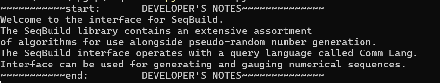

# About: seqbuild 

Sequentete...sequentete, my son. 

Project is being developed in conjunction with 
that of dependency library, `morebs2`. Started out 
as a research project, and I am starting to wrap 
ends to it before the project branches off into 
development hell terrain. 


### Brief Description (Current State)  

Primary use is research of pseudo-random number generators (PRNG). 
`Comm Lang` is the application programming interface that `seqbuild` uses, 
and users can express commands to gauge and generate numerical sequences 
in this language. When user runs `main.py` (the main program), they are 
accessing a semi-autonomous PRNG system for their personal use. They are 
responsible for: 
- initializing generators,  
- gauging generators and numerical sequences,  
- tweaking generators and numerical sequences.  

Autonomous capabilities for `seqbuild` to perpetually output values classified 
as "random", according to certain metrics, have not been implemented.  

The `seqbuild` system can read generators from and write generators to files, via 
a language outside out of the standard Python `pickle` and `json` libraries. 
These two libraries store and load serialized Python objects, and do not support 
the storage of Python objects that are closures or contain closures. A closure 
in the Python programming language is a function nested inside another function; 
there are variants with "lambda","method", and "function". The `seqbuild` system 
is equipped with a language called `Comm Lang` (shorthand for command language). 
`Comm Lang` can be used to instantiate most of the PRNGs provided in this project. 
It can also load vectors into memory and write them out to file. `Comm Lang` scripts 
are text files that follow the rules specified by `seqbuild`'s programming. See the 
folder `face/sample_script` for examples on usage. Also, user can simply run the 
`main.py` file. A user interface pops up, and the `heLP` button provides an introduction 
to `Comm Lang` semantics. 

To start off using this project, 
```
> git clone https://www.github.com/changissnz/seqbuild.git 
> cd seqbuild 
> pip install -r requirements.txt
> py main.py 
```

There is also a convenient way to auto-generate Comm Lang files, which can then be loaded up 
into the user interface at `py main.py`, or used for other purposes. 
```
from face.easy_gen_struct import * 

filepath = "Your_Comm_Lang_filepath.txt"
base_gen_name = "name"
use_prng_for_prng_pr = 0.5

vector_files = ["your_vector_files.txt"]
cl_files = ["other_Comm_Lang_files_you_want_to_load_up.txt"]
consistent_PRNG_output = True | False 

cauto = TimeBasedCommLangFileGenerator(filepath,base_gen_name,\
    use_prng_for_prng_pr,vector_files,cl_files,consistent_PRNG_output)  
cauto.generate()
```

### Update: 06/20/26 
Auto-generation of Comm Lang files can now be executed by the program in `face/easy_gen_struct`. 
It is relatively bug-free, and there are try-except conditions in there to prevent crashes. 

### Update: 06/19/26 

There are a significant number of Comm Lang file bugs that `CommLangParser` will not 
catch. Parser is not fully developed for error-logging. 

### Update: 6/10/26
Project has been open-sourced with MIT license. See [this link](https://pypi.org/project/seqbuild/) 
for that. Development recommences on an arbitrary and rolling basis. 

### Update: 11/2/25 

There is a paper in the folder `info` that discusses `seqbuild` and the topic of randomness. 

### Update: 10/26/25 

Open development of this project has resumed, since I detected some bugs. I'd hate to 
leave any prospective users with a sub-optimal product. 

### Update: 9/17/25 

Open development of this project has now terminated. 


### Update: 8/27/25  

I have decided to add a new folder, `performance_marks`, that contain files named  
`fYxx.txt`, along with their corresponding randomness test results `perfY.txt`. The  
tests are done by an implementation of NIST Randomness Testing Suite. And this implementation 
can be found at the link below.  

`https://github.com/stevenang/randomness_testsuite.git`. 

These test results demonstrate the challenge of ?defining the concept? of random. 

### Update: 8/26/25  

The main program now includes an `encrypt` Comm Lang command. In cases where `np.nan`, 
`np.inf`, or `None` is the ciphertext element, there is not an easy way to map to the 
plaintext character from it. This particular `encrypt` command can be used for 
one-way encryption.

### Update: 8/22/25  

There are still unfinished features in this project. Development will no 
longer proceed at a regular frequency. Rolling developments, of indefinite 
timing, will be pushed to the project.

### Update: 8/14/25

Development is halfway done. The `seqbuild` project now has an interface. 
Here are the steps to using it. 
- go into a terminal prompt and enter in these commands: 
```
> git clone https://www.github.com/changissnz/seqbuild.git 
> cd seqbuild 
> pip install -r requirements.txt
> python3 main.py 
```

Here is my developer note that pops up every time the `main.py` file 
is run. 

  

I have planned for 1 full week of additional development, starting today. 
This will be AGILE end sprint for beta version of this product. 