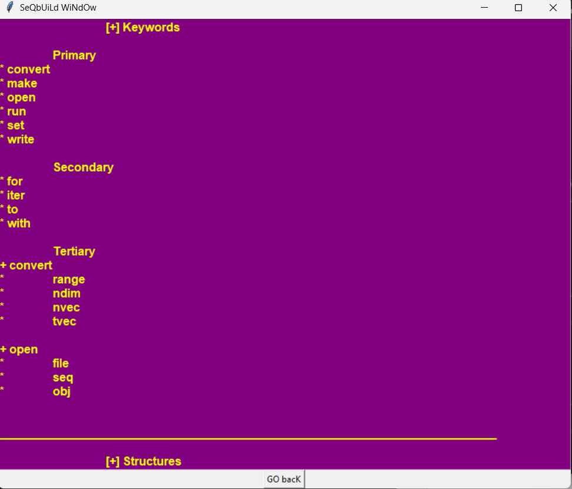
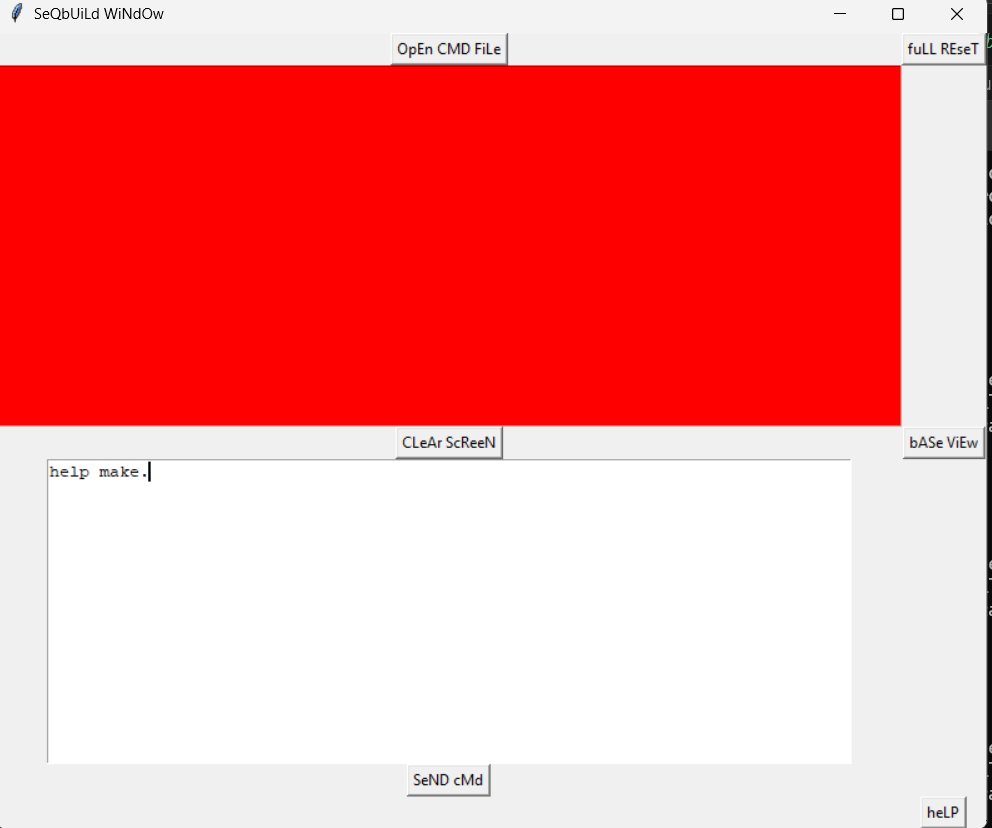
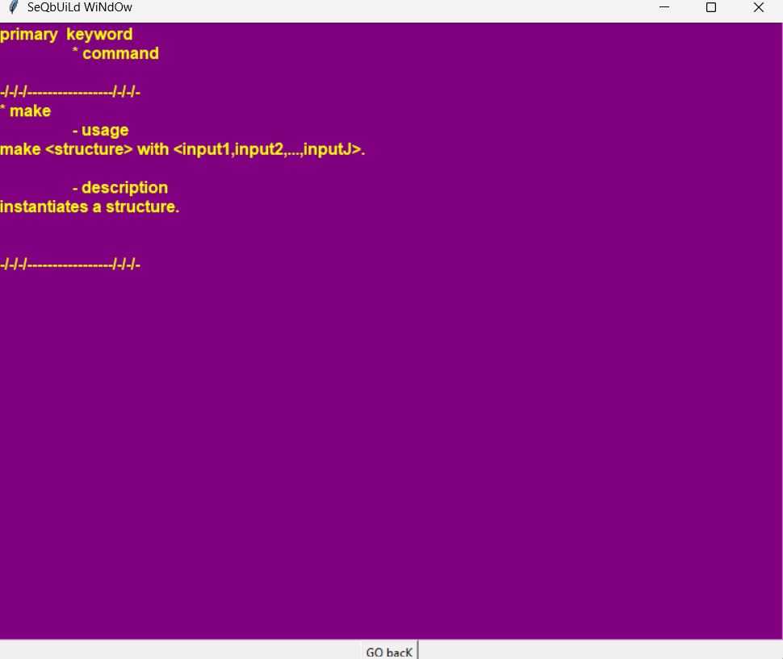

# About: Comm Lang 

## Table of Contents
1. [Description](#description)  
2. [Structures](#structures)  
3. [Keywords](#keywords)  
4. [Command Forms](#command_forms)  
5. [Interface Layout](#interface)  


## Description <a name="description"></a>  

Comm Lang (shorthand for "communication language") is a custom 
language, designed with simplicity in mind, that wraps around 
the code infrastructure of `seqbuild` library. Users of `seqbuild` 
interface can use Comm Lang to write command scripts. Its set of 
keywords is relatively small, much smaller than that of Python 
standard library. And the commands possible to execute via Comm Lang 
are related to `seqbuild` components and capabilities. 

Comm Lang is similar to the Python programming language in regards 
to punctuation in syntax. <ins>End every command with a period. Do not 
separate comma-separated parameter values, used for instantiating a 
structure, with spaces.</ins> The language is also similar to SQL. Whereas 
SQL is a database query language, Comm Lang is a numerical generator language. 

## Structures <a name="structures"></a>  

Most of the structures are numerical generators. One primary 
structure that is not a numerical generator, but quite important 
in this library, is `MultiMetric`. Below is a list of these structures, 
as well as their instantiation parameters in Comm Lang. 

[o] lcg 
- instantiation:  

    1. (int|float,int|float,int|float,int|float)  
    * (start value,multiple,additive,modulus)  

[o] lcgv2 
- instantiation: 

    1. (int|float,int|float,int|float,int|float,int|float)  
    * (start value,multiple,additive,start modulus,end modulus)  

    2. (int|float,int|float,int|float,int|float,int|float,int,bool)  
    * (start value,multiple,additive,start modulus,end modulus,memory vector size,graph decomposition)  

[o] lcgv3 
- instantiation: 

    1. (int|float,int|float,int|float,int|float,int|float)   
    * (start value,multiple,additive,start modulus,end modulus)     

    2. (int|float,int|float,int|float,int|float,int|float,function,
      int|float,int|float)  
    * (start value,multiple,additive,start modulus,end modulus,
        inputless generator,super-range start,super-range end)   

    3. (int|float,int|float,int|float,int|float,int|float,function,
      int|float,int|float,bool)  
    * (start value,multiple,additive,start modulus,end modulus,
        inputless generator,super-range start,super-range end,exclude zero trinary)  

    4. (int|float,int|float,int|float,int|float,int|float,function,
      int|float,int|float,bool,bool)  
    * (start value,multiple,additive,start modulus,end modulus,
        inputless generator,super-range start,super-range end,
        exclude zero trinary mode, reflective modification mode)  


[o] mdr 
- instantiation:  

    1. (list)  
    * (numerical sequence)  

[o] mdrv2 
- instantiation:  

    1. (list)  
    * (numerical sequence)  

    2. (list,bool)  
    * (numerical sequence, exclude negative multiples)  

[o] mdrgen 
- instantiation:  

    1. (mdr|mdrv2,function,bool,1|2)  
    * (reference `ModuloDecompRepr`,inputless generator,generative type)  

    2. (mdr|mdrv2,function,bool,1|2,bool,bool,bool,bool,bool)  
    * (reference `ModuloDecompRepr`,inputless generator,generative type,
        row-column switch,selector switch 1,selector switch 2, selector switch 3, 
        input seed in output)  

[o] optri  
- instantiation: 

    1. (int,function,1|2,bool,list)  
    * (integer seed,inputless generator,generative type,add noise,base sequence)  

[o] qval  
- instantiation:  

    1. (list,function,function,function,1|2)  
    * (base sequence,inputless generator,inputless generator,
        inputless generator,adjustment type)  
    * (!,index selector,length outputter,range outputter,!)

[o] pid  

- instantiation:  

    1. (function,function,function,1|2)  
    * (inputless generator,inputless generator,inputless generator,adjustment type)  
    * (base generator,frequency generator,length generator,range generator,!)  

[o] multimetric  

- instantiation:  

    1. (list)  
    * (base sequence)  

- `run with` parameter:  

    1. (integer)  
    * (positive integer specifying n-gram)  

[o] op2   

- instantiation:  

    1. (`+|-|*|/`)  
    * (primary pairwise arithmetic operator)  

    2. (`+|-|*|/|custom`,`+|-|*|/|custom`,float)  
    * (pairwise operator,pairwise operator,weight)  

    3. (`+|-|*|/|custom`,`+|-|*|/|custom`,float,0|1|2)  
    * (pairwise operator,pairwise operator,weight,operator order)  


## Keywords <a name="keywords"></a>  


- Primary  
    [-] make  
    [-] run  
    [-] set  
    [-] write  
    [-] open  
    [-] convert  
    [-] merge  
    [-] load  
    [-] qualtest  
    [-] chaintest  

- Secondary  
    [-] with  
    [-] for  
    [-] iter  
    [-] to  

- Tertiary  
    [-] associated with `open`:  
        * file  
        * seq  
        * obj  
    [-] associated with `convert`:  
        * range  
        * ndim  
        * nvec  
        * tvec  
    [-] associated with `set`:  
        * span     
    [-] associated with `merge`:  
        * +  
        * -  
        * /  
        * *  


## Command Forms <a name="command_forms"></a>  


[+] make  
[-] usage  
```
make <structure> with <input1,input2,...,inputJ>. 
```
[-] description  
instantiates a structure.  

-----------------------------------------------------------------

[+] run  
[-] usage   
```
run <structure>.  
run <structure> with <input1,...,inputJ>.  
run <structure> for <positive integer> iter.  
```
[-] description  
calls the structure's main output function. 

-----------------------------------------------------------------

[+] set  
[-] usage  
```
set <variable name> = <command statement that produces object>.  
set <generator> span for <start range,end range>.  
```
[-] description  
in the primary use case, command loads an object into parser map of 
variables. In the secondary use case, command sets output of generator 
into ranged modulo. 

-----------------------------------------------------------------

[+] open  
[-] usage  
```
open file <filepath>.  
open file <filepath> for seq.  
open file <filepath> for obj.   
```
[-] description  
loads a file into a program object. By default, opens file in 
bytes mode to store objects. Specifying `for seq` opens file in 
regular string mode and `for obj` opens file in bytes mode.  

-----------------------------------------------------------------

[+] write  
[-] usage  
```
write <object> to <file_object>.  
write <generator> for <positive integer> iter to <file_object>.  
``` 
[-] description  
writes an object loaded in program memory to a file. In the secondary  
use case, writes the streaming output (in real-time) from `generator` to  
the file for the specified number of iterations. 

-----------------------------------------------------------------

[+] convert  
[-] usage  
```
convert <generator> to range.  
convert <generator> to ndim with <positive_integer_sequence>.  
convert <generator> to nvec with <positive_integer>.  
convert <generator> to tvec with <positive_integer>.  
```
[-] description  
converts an inputless generator function that outputs single integer 
or float values into a generator that outputs a different type. 
Available types are `range` (outputs ordered pairs of numbers), 
`ndim` (outputs integer vectors of lengths equal to that of the positive 
integer sequence), `nvec` (outputs numerical vectors of length equal to 
the positive integer), and `tvec` (outputs specifically trinary vectors 
of length equal to the positive integer). Such conversions are usually 
to help instantiate a structure. For example, the `pid` generator 
requires a range generator as its primary argument. 

-----------------------------------------------------------------  

[+] merge  
[-] usage  
```
merge <generator_1,...,generator_j> with <operator_1,...,operator_(j-1)>.  
```
[-] description  
Produces a new generator `G_(j+1)` out of a list of `j` generators,  
`j` at least 2. Every output value of `G_(j+1)` is  
    `G_1 op_1 G_2 op_2 ... G_(j-1) op_(j-1) G_j.`  

-------------------------------------------------------------------  

[+] load  
[-] usage  
```  
load <path for Comm Lang file>.  
```  
[-] description  
Loads command content from the specific Comm Lang file into  
parser queue. Parser processes these Comm Lang commands and loads  
the pertaining variables into parser memory and also window view.  

-------------------------------------------------------------------  

[+] qualtest  
[-] usage  
```  
qualtest <generator> for <positive integer> iter.  
qualtest <generator> for <pos. int.> iter with <positive integer>.  
qualtest <generator> for <pos. int.> iter with <comma-separated pos. int.>.   

qualtest <generator,generator2> for <positive integer> iter.  
qualtest <generator,generator2> for <pos. int.> iter with ...   
```  
[-] description  
Command is used to test the output quality of numerical generators. The  
focus is on the next `x` elements (iterations). In the primary use case,  
command calculates these measures: coverage,  normalized unidirectional  
weighted point distance, standard categorical entropy, Kolmogorov complexity  
of 1st-order difference, Kolmogorov complexity of 2nd-order difference,  
and Kolmogorov complexity of MCS (most common subsequence) difference.  
Additionally, command outputs the top five integer factors and their  
associated 1st+2nd order Kolmogorov complexities for the `x` elements.  
Element frequency map is also output.  In the secondary use case, command  
is used in the manner of a comparative function between two generators.  
In such cases, command outputs the difference of `qualtest` measures  
applied to each generator.  

WARNING: `qualtest` conducts highly intensive computation. For typical  
use, set iterations to at most 1000. 

-----------------------------------------------------------------   

[+] chaintest  
[-] usage  
```  
chaintest <generator> with <number of iterations,chain length>.   
chaintest <generator1,generator2> with <number of iterations,chain length>.   
```  
[-] description  
This is a lightweight alternative to the `qualtest` command. The  
chain test is designed for sparsely informative numerical sequences.  
This test has a higher threshold for number of iterations. Test  
calculates comparative values between the contiguous chunks, most  
of which have number of elements equal to the chain length. Measures  
of interest are minumum and maximum values. Mean and variance are  
calculated from the (minumum,maximum) of every chunk. Chain test also  
observes the changes in factor frequency between each chunk. These changes  
are, in their primary representation, are maps of (factor,frequency)  
differences. These maps are reduced to single floats. Mean and variance  
are finally calculated for these floats. The output from this test is a  
4 x 2 matrix of the values described. Similar to `qualtest`, the secondary  
use case of `chaintest` is a comparative test between two generators, such  
that the output is the difference between their associated 4 x 2 matrices.  

-----------------------------------------------------------------  

[+] show  
[-] usage  
```
show <object>.  
```
[-] description  
A special command reserved exclusively for realtime command use. A 
realtime command is made and executed in the `seqbuild` interface. The 
`show` command lets users view the object of their query. 

-------------------------------------------------------------------  

## Interface Layout <a name="interface"></a>  
 

  

The interface consists of a primary window that is a dual-screen. The 
red half is the SHOW window and the white half is the QUERY window. 
Users can enter in Comm Lang commands into the QUERY window, in addition 
to processing Comm Lang command files by first opening them up with the 
`OpEn CMD FiLe` button. The QUERY window is meant to be a supplementary 
commandline-like interface for additional work on top of processing 
entire Comm Lang command files. For example, users can view variable 
values using the QUERY window. In the QUERY window, users enter in their 
wanted Comm Lang commands (by the correct syntax, of course) before 
pressing the `SeND cMd` button. 

In this next example, user opens up Comm Lang command file `commond_nine.txt`.  

  

The next image displays the user's SHOW window, now with a list of variable 
names and their types parsed from `commond_nine.txt` and processed by `seqbuild`.   

  

In the QUERY window, there is the command `show V`.  

 

To go back to the default SHOW window, the one with the list of variable names 
and types from all files and realtime commands processed thus far, press the 
`bASe ViEw` button.  

If the `fuLL REseT` button is pressed, program deletes all variables and information 
processed by the Comm Lang parser during the session.  

  

If user does not recall Comm Lang syntax, they can press the `heLP` button.  

  

If user wants to know syntax and description for a keyword or structure, user 
can type `help term` in the QUERY window.  

  

  

