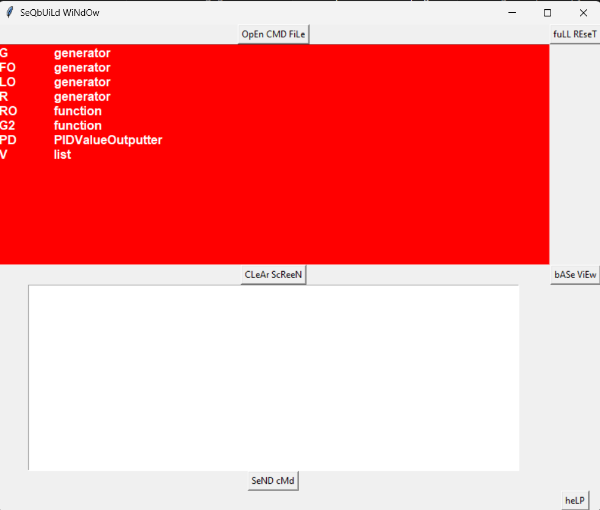

# About: Comm Lang 

## Description

Comm Lang (shorthand for "communication language") is a custom 
language, designed with simplicity in mind, that wraps around 
the code infrastructure of `seqbuild` library. Users of `seqbuild` 
interface can use Comm Lang to write command scripts. Its set of 
keywords is relatively small, much smaller than that of Python 
standard library. And the commands possible to execute via Comm Lang 
are related to `seqbuild` components and capabilities.

## Structures 

Most of the structures are numerical generators. One primary 
structure that is not a numerical generator, but quite important 
in this library, is `MultiMetric`. Below is a list of these structures, 
as well as their instantiation parameters in Comm Lang. 

[o] lcg 
- instantiation:  

    1. (int|float,int|float,int|float,int|float)  
    * (start value,multiple,additive,modulus)  

[o] lcgv2 
- instantiation: 

    1. (int|float,int|float,int|float,int|float,int|float)  
    * (start value,multiple,additive,start modulus,end modulus)  

    2. (int|float,int|float,int|float,int|float,int|float,int,bool)  
    * (start value,multiple,additive,start modulus,end modulus,memory vector size,graph decomposition)  

[o] lcgv3 
- instantiation: 

    1. (int|float,int|float,int|float,int|float,int|float)   
    * (start value,multiple,additive,start modulus,end modulus)     

    2. (int|float,int|float,int|float,int|float,int|float,function,
      int|float,int|float)  
    * (start value,multiple,additive,start modulus,end modulus,
        inputless generator,super-range start,super-range end)   

    3. (int|float,int|float,int|float,int|float,int|float,function,
      int|float,int|float,bool)  
    * (start value,multiple,additive,start modulus,end modulus,
        inputless generator,super-range start,super-range end,exclude zero trinary)  

    4. (int|float,int|float,int|float,int|float,int|float,function,
      int|float,int|float,bool,bool)  
    * (start value,multiple,additive,start modulus,end modulus,
        inputless generator,super-range start,super-range end,
        exclude zero trinary mode, reflective modification mode)  


[o] mdr 
- instantiation:  

    1. (list)  
    * numerical sequence  

[o] mdrv2 
- instantiation:  

    1. (list)  
    * numerical sequence  

    2. (list,bool)  
    * numerical sequence, exclude negative multiples  

[o] mdrgen 
- instantiation:  

    1. (mdr|mdrv2,function,bool,1|2)  
    * (reference `ModuloDecompRepr`,inputless generator,generative type)  

    2. (mdr|mdrv2,function,bool,1|2,bool,bool,bool,bool,bool)  
    * (reference `ModuloDecompRepr`,inputless generator,generative type,
        row-column switch,selector switch 1,selector switch 2, selector switch 3, 
        input seed in output)  

[o] optri  
- instantiation: 

    1. (int,function,1|2,bool,list)  
    * (integer seed,inputless generator,generative type,add noise,base sequence)  

[o] qval  
- instantiation:  

    1. (list,function,function,function,1|2)  
    * (base sequence,inputless generator,inputless generator,
        inputless generator,adjustment type)  
    * (!,index selector,length outputter,range outputter,!)

[o] pid  

- instantiation:  

    1. (function,function,function,1|2)  
    * (inputless generator,inputless generator,inputless generator,
        adjustment type)  
    * (base generator,frequency generator,length generator,range generator,!)  

[o] multimetric  

- instantiation:  

    1. (list)  
    * (base sequence)  

- `run with` parameter:  

    1. (integer)  
    * (positive integer specifying n-gram)  


## Keywords 

- Primary  
    [-] make  
    [-] run  
    [-] set  
    [-] write  
    [-] open  
    [-] convert  

- Secondary  
    [-] with  
    [-] for  
    [-] iter  
    [-] to  

- Tertiary  
    [-] associated with `open`:  
        * file  
        * seq  
        * obj  
    [-] associated with `convert`:  
        * range  
        * ndim  
        * nvec  
        * tvec  

## Command Forms 

[+] make  
[-] usage  
```
make <structure> with <input1,input2,...,inputJ>. 
```
[-] description  
instantiates a structure.  

-----------------------------------------------------------------

[+] run  
[-] usage   
```
run <structure>.  
run <structure> with <input1,...,inputJ>.  
run <structure> for <positive integer> iter.  
```
[-] description  
calls the structure's main output function. 

-----------------------------------------------------------------

[+] set 
[-] usage
```
set <variable name> = <command statement that produces object>. 
```
[-] description  
loads an object into parser map of variables.  

-----------------------------------------------------------------

[+] open  
[-] usage  
```
open file <filepath>.  
open file <filepath> for seq.  
open file <filepath> for obj.   
```
[-] description  
loads a file into a program object. By default, opens file in 
bytes mode to store objects. Specifying `for seq` opens file in 
regular string mode and `for obj` opens file in bytes mode.  

-----------------------------------------------------------------

[+] write  
[-] usage  
```
write <object> to <file_object>.  
``` 
[-] description  
writes an object loaded in program memory to a file object. 

-----------------------------------------------------------------

[+] convert  
[-] usage 
```
convert <generator> to range.  
convert <generator> to ndim with <positive_integer_sequence>.  
convert <generator> to nvec with <positive_integer>.  
convert <generator> to tvec with <positive_integer>.  
```
[-] description 
converts an inputless generator function that outputs single integer 
or float values into a generator that outputs a different type. 
Available types are `range` (outputs pairs of ordered numbers), 
`ndim` (outputs integer vectors of lengths equal to that of the positive 
integer sequence), `nvec` (outputs numerical vectors of length equal to 
the positive integer), and `tvec` (outputs specifically trinary vectors 
of length equal to the positive integer). Such conversions are usually 
to help instantiate a structure. For example, the `pid` generator 
requires a range generator as its primary argument. 

-----------------------------------------------------------------

[+] show  
[-] usage  
```
show <object>.  
```
[-] description  
A special command reserved exclusively for realtime command use. A 
realtime command is made and executed in the `seqbuild` interface. The 
`show` command lets users view the object of their query. 

-------------------------------------------------------------------

## Interface Layout 

  

The interface consists of a primary window that is a dual-screen. The 
red half is the SHOW window and the white half is the QUERY window. 
Users can enter in Comm Lang commands into the QUERY window, in addition 
to processing Comm Lang command files by first opening them up with the 
`OpEn CMD FiLe` button. The QUERY window is meant to be a supplementary 
commandline-like interface for additional work on top of processing 
entire Comm Lang command files. For example, users can view variable 
values using the QUERY window. In the QUERY window, users enter in their 
wanted Comm Lang commands (by the correct syntax, of course) before 
pressing the `SeND cMd`. 

In this next example, user opens up Comm Lang command file `commond_nine.txt`.  

  

The next image displays the user's SHOW window, now with a list of variable 
names and their types parsed from `commond_nine.txt` and processed by `seqbuild`.   

  

In the QUERY, there is the command `show V`.  

 

To go back to the default SHOW window, the one with the list of variable names 
and types from all files and realtime commands processed thus far, press the 
`bASe ViEw` button.  

If the `fuLL REseT` button is pressed, program deletes all variables and information 
processed by the Comm Lang parser during the session.  

  

